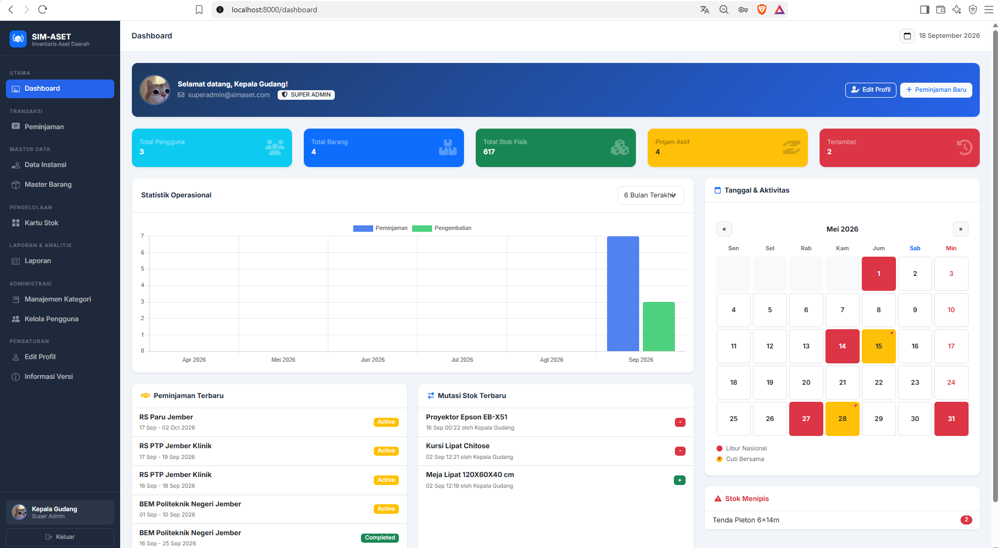
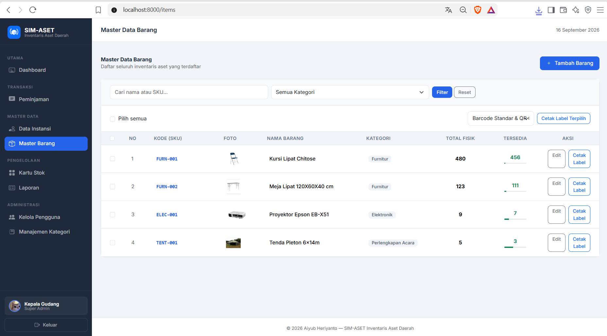
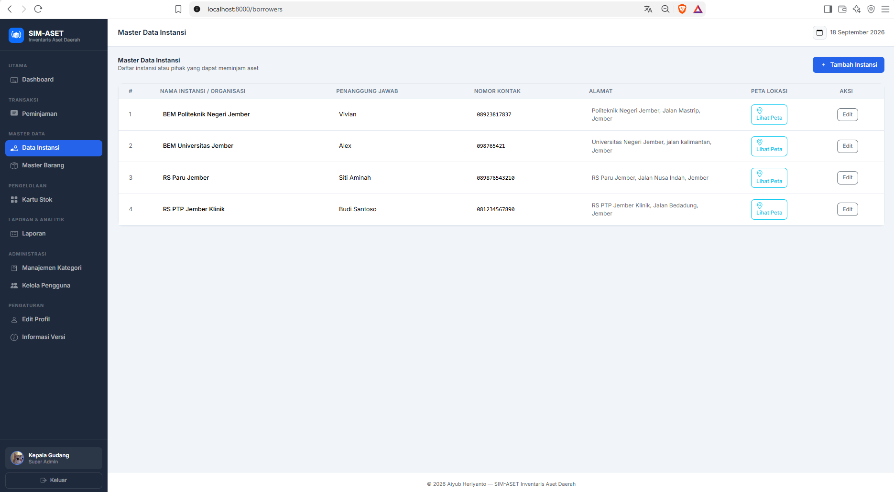
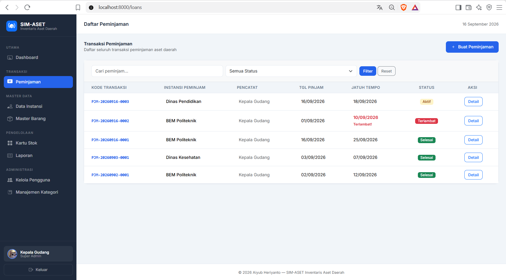
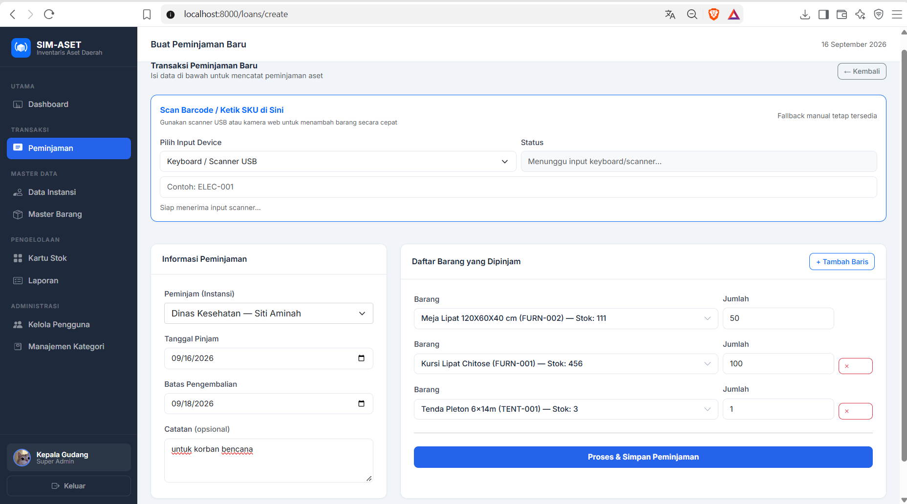
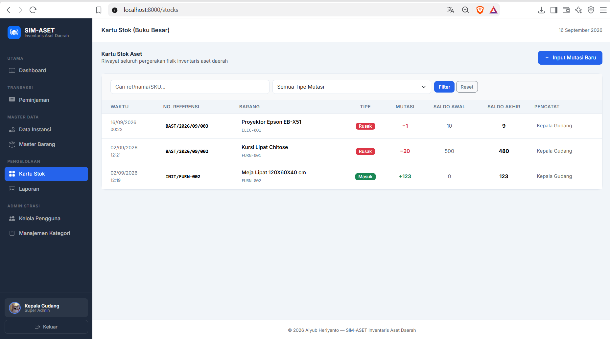
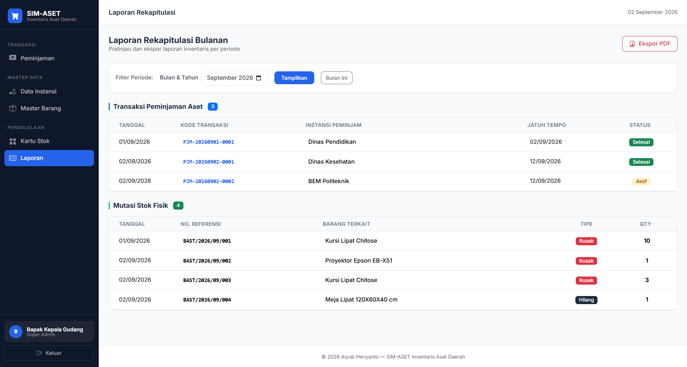

# SIM-ASET

Sistem Inventaris Aset Daerah berbasis Laravel untuk mengelola data barang, stok, peminjaman, pengembalian, serta laporan operasional inventaris di lingkungan pemerintah daerah.


---

## Tentang Proyek

Project ini adalah versi yang sedang dikembangkan untuk kebutuhan pengelolaan aset pemerintahan secara terstruktur dan audit-friendly.

Tujuan utama dari aplikasi ini adalah:

- mengelola master data barang dan instansi peminjam,
- menjaga integritas stok melalui ledger mutasi,
- membatasi akses berdasarkan role pengguna,
- mencatat seluruh proses peminjaman dan pengembalian secara terdokumentasi,
- menghasilkan laporan dan dokumen PDF yang dapat dipakai sebagai bukti operasional.

Aplikasi ini dibangun dengan Laravel 12, Bootstrap 5, serta Spatie Laravel Permission untuk kontrol akses.

---

## Status Versi Saat Ini

Versi project yang ada saat ini sudah mencakup fitur inti berikut:

- autentikasi pengguna dengan Laravel Breeze,
- role management dengan 3 level utama: Super Admin, Admin, dan Staff Logistik,
- manajemen barang dan instansi peminjam,
- pencatatan mutasi stok dan Kartu Stok,
- transaksi peminjaman dan pengembalian barang,
- validasi keamanan input dan format data,
- laporan bulanan dan PDF,
- akses fitur berdasarkan peran akun.

Dokumen lanjutan mengenai roadmap dan konteks proyek tersedia di folder docs.

---

## Struktur Role Saat Ini

### Super Admin
- mengakses semua modul operasional,
- dapat mengelola pengguna dan role,
- mengatur konfigurasi akses sistem.

### Admin
- dapat mengakses modul master data, stok, peminjaman, report,
- tidak dapat mengelola role atau menambah user baru.

### Staff Logistik
- dapat membuat dan melihat transaksi peminjaman yang dibuat dirinya,
- tidak dapat mengelola user maupun role,
- tidak dapat melihat seluruh transaksi milik user lain.

---

## Alur Kerja Aplikasi

Alur kerja aplikasi yang benar sesuai versi sekarang adalah sebagai berikut:

```text
Login
  ↓
Siapkan Master Data
  ├─ Kategori
  ├─ Barang
  ├─ Instansi / Peminjam
  └─ Lokasi (jika dibutuhkan)
  ↓
Input Stok Awal / Mutasi Stok
  ↓
Buat Transaksi Peminjaman
  ├─ pilih peminjam
  ├─ pilih barang
  ├─ pilih qty
  └─ simpan transaksi
  ↓
Validasi stok tersedia
  ↓
Transaksi aktif / status dipinjam
  ↓
Proses pengembalian barang
  ├─ pengembalian sebagian
  └─ pengembalian penuh
  ↓
Update ketersediaan stok
  ↓
Laporan & PDF
```

---

## Arsitektur Aplikasi

Aplikasi dibangun menggunakan pola arsitektur MVC (Model-View-Controller) dengan Service Layer untuk memisahkan logika bisnis yang kompleks dari Controller.

### Tech Stack
- **Backend**: Laravel 12.x, PHP 8.2+
- **Frontend**: Bootstrap 5.x, Blade Templating, TomSelect/Select2, Chart.js
- **Database**: SQLite (Development), MySQL/MariaDB (Production)
- **Otentikasi & Otorisasi**: Laravel Breeze, Spatie Laravel Permission

### Struktur Database & ERD Context

Berikut adalah gambaran relasi entitas utama dalam sistem:
- **`users`**: Menyimpan data login dan role (Super Admin, Admin, Staff Logistik).
- **`categories`**: Klasifikasi master barang (memiliki `prefix` untuk generate SKU).
- **`items`**: Master data barang, terhubung dengan `categories`. Menyimpan total qty dan available qty.
- **`borrowers`**: Entitas instansi/pihak luar yang meminjam barang.
- **`loans`**: Data header transaksi peminjaman (terhubung ke `users` pembuat dan `borrowers`).
- **`loan_items`**: Detail barang apa saja yang dipinjam beserta jumlahnya (terhubung ke `loans` dan `items`).
- **`stock_movements`**: Ledger mutasi stok (in/out), terhubung ke `items` dan `users`, tidak pernah di-delete untuk menjaga audit trail.

### Alur Proses Bisnis (Service Layer)

Project ini memisahkan logika bisnis dari controller agar lebih aman dan terstruktur.

```text
Browser
  ↓
Routes
  ↓
Controller
  ↓
Service Layer
  ├─ LoanService (Transaksi Peminjaman & Pengembalian)
  └─ StockService (Mutasi & Ledger Stok)
  ↓
Model / Database
```

- `LoanService` menangani pembuatan transaksi peminjaman dan proses pengembalian.
- `StockService` menangani mutasi stok dan perubahan saldo barang.
- Penggunaan **Database Transactions** dan `lockForUpdate()` dipakai untuk mencegah race condition saat mutasi/transaksi terjadi bersamaan.
- Perubahan ketersediaan stok (`available_qty`) terjadi otomatis beriringan dengan `stock_movements` atau status dari `loan_items`.

---

## Fitur Utama yang Sudah Ada

### 1. Autentikasi & Role Access
- login/logout menggunakan Laravel Breeze,
- redirect langsung ke login untuk route yang tidak boleh diakses publik,
- route register dan forgot-password diarahkan ke halaman login,
- akses fitur dibatasi berdasarkan role.

### 2. Master Data Barang
- input barang baru,
- otomatis generate SKU berdasarkan kategori,
- validasi input nama barang untuk mencegah karakter berbahaya,
- perubahan total stok wajib tetap konsisten dengan barang yang masih dipinjam.

### 3. Master Data Instansi / Peminjam
- data instansi, PIC, kontak, dan alamat,
- validasi nama instansi agar aman dari karakter berbahaya,
- tidak ada akses publik untuk menambah data tanpa login.

### 4. Kartu Stok / Stock Movement
- mencatat semua mutasi barang masuk, keluar, rusak, dan hilang,
- format referensi wajib mengikuti pola: `BAST/YYYY/MM/NNN`,
- setiap mutasi terdokumentasi dengan keterangan dan user yang membuatnya.

### 5. Peminjaman Barang
- satu transaksi dapat berisi beberapa item,
- validasi stok yang tersedia sebelum transaksi disimpan,
- catatan peminjaman bisa diisi pada form,
- status transaksi aktif sampai seluruh item dikembalikan.

### 6. Pengembalian Barang
- mendukung pengembalian sebagian maupun penuh,
- update available_qty dilakukan setelah pengembalian,
- status otomatis berubah menjadi completed ketika semua item sudah kembali.

### 7. Laporan dan PDF
- laporan rekapitulasi bulanan,
- laporan stok / mutasi,
- export PDF untuk transaksi dan laporan.

### 8. Keamanan Input
- sanitasi XSS awal pada middleware,
- validasi FormRequest untuk pencegahan payload berbahaya,
- validasi format nomor referensi dan nama entitas,
- filter terhadap karakter HTML/script yang tidak aman.

---

## Preview Fitur Utama

Berikut beberapa preview halaman utama dari aplikasi yang tersedia di folder docs/images dengan versi final yang dimaksudkan untuk dokumentasi.

### Dashboard


### Master Barang


### Daftar Peminjam


### Daftar Peminjaman


### Form Peminjaman


### Kartu Stok / Mutasi


### Laporan


---

## Proses Kerja yang Benar di Aplikasi Saat Ini

### A. Persiapan data awal
1. Login sebagai Super Admin atau Admin.
2. Siapkan kategori barang.
3. Tambahkan barang baru.
4. Jika diperlukan, isi stok awal.
5. Tambahkan data instansi peminjam.

### B. Membuat peminjaman
1. Buka menu peminjaman.
2. Pilih instansi peminjam.
3. Pilih item yang dipinjam.
4. Masukkan jumlah.
5. Isi catatan jika ada.
6. Sistem akan memvalidasi ketersediaan stok.
7. Simpan transaksi.

### C. Pengembalian barang
1. Buka detail transaksi peminjaman.
2. Masukkan jumlah barang yang dikembalikan.
3. Sistem akan mengecek sisa hutang item.
4. Simpan pengembalian.
5. Stok tersedia akan bertambah kembali.

### D. Monitoring data
1. Periksa Kartu Stok untuk riwayat mutasi.
2. Gunakan laporan untuk melihat rekap bulanan.
3. Pastikan semua perubahan stok berkaitan dengan riwayat audit yang jelas.

---

## Rute Akses Saat Ini

Beberapa rute utama yang ada dalam aplikasi:

```text
/login
/logout
/dashboard
/items
/borrowers
/stocks
/reports
/users
```

Akses route dikelola berdasarkan role:

- `items`, `borrowers`, `stocks`, `reports` -> Admin dan Super Admin
- `users` -> Super Admin saja
- `loans` -> semua user login, namun Staff Logistik hanya melihat transaksi yang dibuat dirinya

---

## Data Awal (Seeder)

Saat menjalankan seeder, aplikasi akan mengisi role dan akun default seperti berikut:

```text
Email: superadmin@pemda.go.id
Password: password123
Role: Super Admin
```

```text
Email: admin@pemda.go.id
Password: password123
Role: Admin
```

```text
Email: staff@pemda.go.id
Password: password123
Role: Staff Logistik
```

> Kredensial ini hanya untuk kebutuhan development dan testing. Jangan dipakai di lingkungan produksi.

---

## Persyaratan Sistem

- PHP 8.2+
- Composer
- Node.js + NPM
- Database Laravel yang didukung (SQLite atau MySQL)

---

## Instalasi Cepat

### 1. Clone project

```bash
git clone https://github.com/Aiyub150/SIM-ASET.git
cd web_inventaris
```

### 2. Install dependency PHP

```bash
composer install
```

### 3. Install dependency frontend

```bash
npm install
```

### 4. Konfigurasi environment

```bash
copy .env.example .env
```

atau di PowerShell:

```powershell
Copy-Item .env.example .env
```

### 5. Generate key

```bash
php artisan key:generate
```

### 6. Konfigurasi database

Untuk SQLite:

```bash
touch database/database.sqlite
```

Pastikan `.env` berisi:

```env
DB_CONNECTION=sqlite
```

Atau untuk MySQL:

```env
DB_CONNECTION=mysql
DB_HOST=127.0.0.1
DB_PORT=3306
DB_DATABASE=web_inventaris
DB_USERNAME=root
DB_PASSWORD=
```

### 7. Jalankan migrasi

```bash
php artisan migrate
```

### 8. Jalankan seeder

```bash
php artisan db:seed
```

### 9. Jalankan aplikasi

```bash
php artisan serve
```

Lalu buka:

```text
http://127.0.0.1:8000
```

---

## Dokumentasi Pendukung

Dokumen referensi proyek saat ini berada di folder docs:

- docs/Projectcontext.md
- docs/Ecosystem.md
- docs/Futureroadmap.md
- docs/Refactorndebug.md

Dokumen-dokumen ini menjelaskan konteks bisnis, arsitektur, roadmap, dan catatan refactor yang sudah diproses pada project.

---

## Catatan Teknis

- frontend menggunakan Bootstrap 5 dan Blade,
- transaksi dibuat melalui service layer agar lebih aman dan dapat dipantau,
- validasi input dan sanitasi XSS diterapkan agar data tidak masuk dengan karakter mencurigakan,
- mutasi stok merupakan satu-satunya mekanisme yang digunakan untuk perubahan saldo barang,
- struktur project fokus pada audit trail, keamanan data, dan kontrol akses berbasis role.

---

## Lisensi

Project ini dibuat untuk kebutuhan internal sistem inventaris aset daerah dan dapat disesuaikan dengan kebijakan organisasi atau instansi yang menggunakannya.

---

## Pengembang

Aiyub Heriyanto

GitHub: https://github.com/Aiyub150

## Integrasi & API Eksternal
SIM-ASET menggunakan API dari https://api.kemendesa.link/libur-nasional untuk menarik data Hari Libur Nasional yang ditampilkan pada Dashboard dan Modal Kalender. API ini di-cache selama 1 hari (24 jam) di sisi server untuk menghemat _bandwidth_ dan meminimalisir _downtime_.

## Persyaratan Fitur Scanner (Kamera)
Fitur pemindaian Barcode / QR Code pada form peminjaman mengandalkan API getUserMedia bawaan browser. **Agar browser mengizinkan akses ke perangkat kamera, aplikasi SIM-ASET harus dijalankan di atas koneksi yang aman (HTTPS)**. Jika Anda mengaksesnya secara lokal di mesin pengembangan (misal: http://localhost), browser pada umumnya memberikan pengecualian _secure-context_. Namun, jika Anda mengaksesnya dari jaringan LAN (http://192.168.x.x), fitur kamera kemungkinan besar akan ditolak oleh browser seluler maupun desktop. Gunakan SSL/TLS pada tahapan _production_ atau _staging_.

