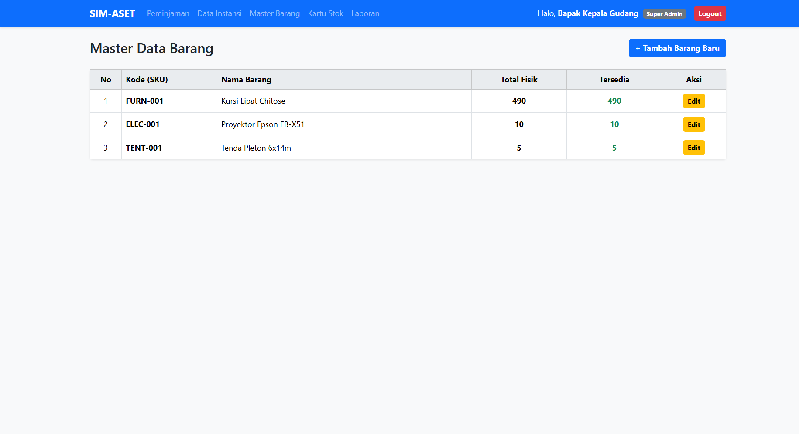
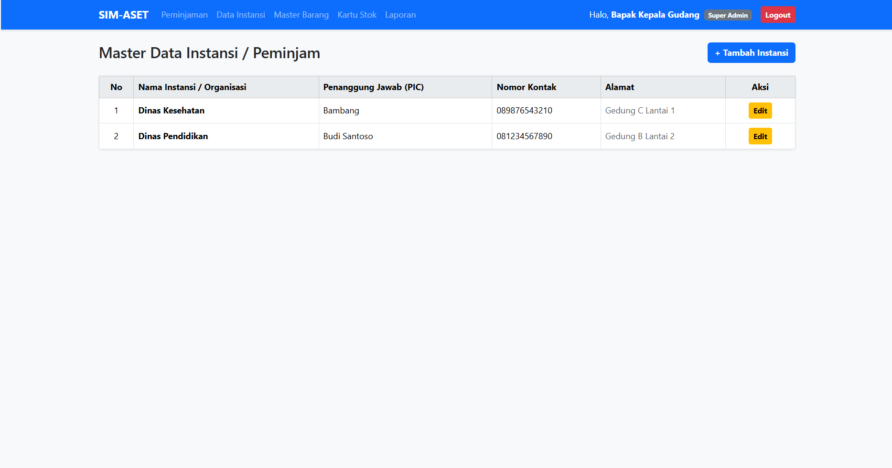
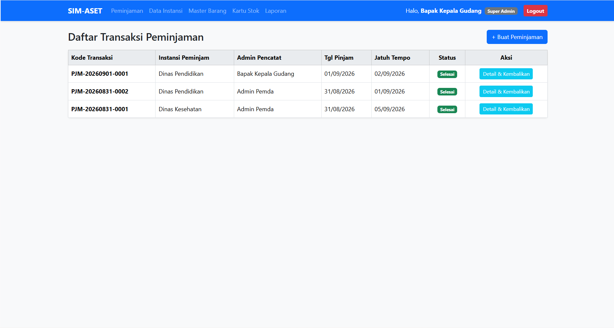
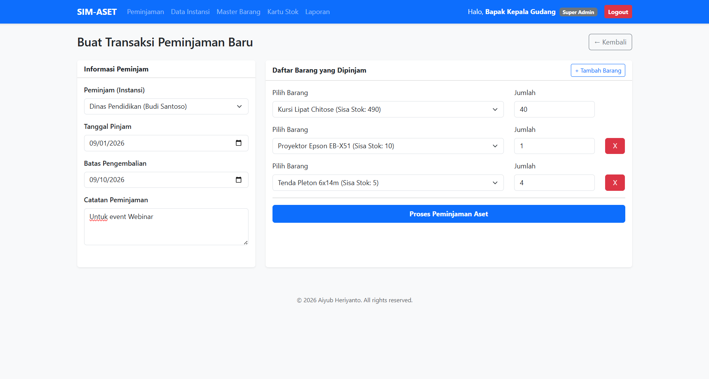
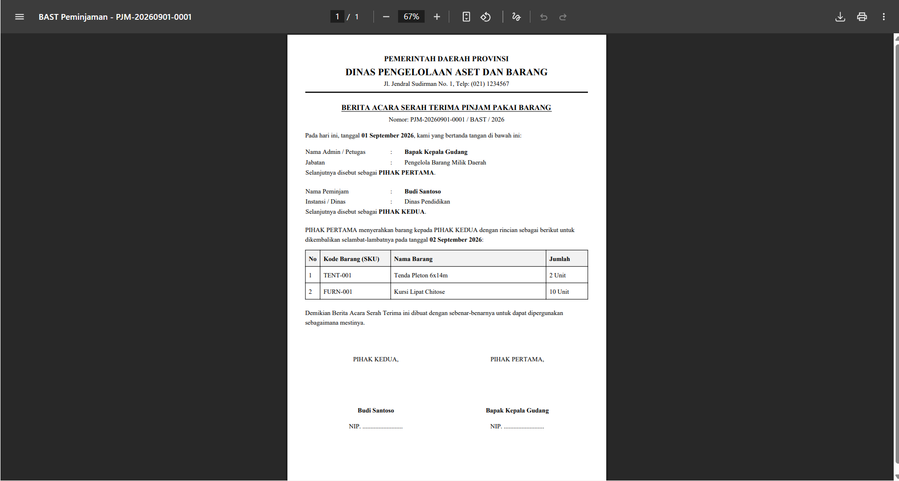
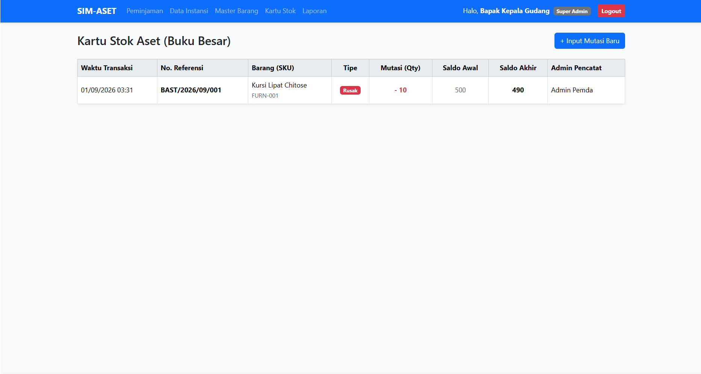
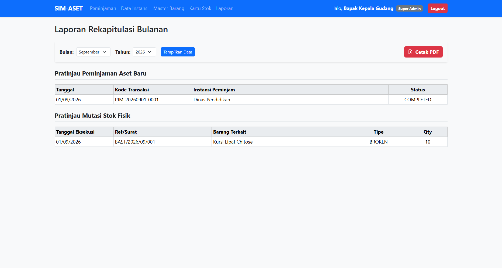

# Web Inventaris Pemerintah Daerah


---

## 📌 Tentang Proyek

**Web Inventaris Pemerintah Daerah (SIM-ASET)** adalah aplikasi berbasis web yang dikembangkan menggunakan **Laravel 12** untuk membantu pengelolaan inventaris serta proses peminjaman barang pada lingkungan Pemerintah Daerah.

Aplikasi ini menyediakan sistem terpusat untuk mengelola data barang, kategori, lokasi penyimpanan, peminjam, transaksi peminjaman, pengembalian, pergerakan stok, hingga pembuatan laporan.

Sistem menerapkan **Role-Based Access Control (RBAC)** sehingga hak akses pengguna dapat dibedakan berdasarkan peran, seperti **Super Admin** dan **Staff Logistik**.

Repository:
> https://github.com/Aiyub150/web-inventaris-pemda

---

# ✨ Fitur Utama

## 1. 🔐 Autentikasi & Hak Akses Pengguna

Aplikasi menyediakan autentikasi pengguna serta pembatasan akses berdasarkan role.

Sistem menggunakan **Laravel Breeze** untuk autentikasi dan **Spatie Laravel Permission** untuk pengelolaan role dan permission.

Role yang tersedia pada data awal:

- **Super Admin**
- **Staff Logistik**

Hak akses pengguna dibatasi sesuai role yang diberikan sehingga fitur administrasi dan operasional dapat dikelola secara terkontrol.

---

## 2. 📦 Manajemen Barang

Fitur manajemen barang digunakan untuk mengelola seluruh data inventaris yang tersedia.

Informasi barang dapat mencakup:

- SKU / kode barang
- Nama barang
- Kategori
- Lokasi
- Jumlah stok
- Jumlah stok tersedia

Administrator dapat menambahkan serta memperbarui data barang yang telah tersedia.

### 🖼️ Tampilan Manajemen Barang

Halaman ini menampilkan daftar inventaris beserta informasi utama seperti kode, nama, kategori, lokasi, dan stok barang.



---

## 3. 🗂️ Manajemen Kategori

Kategori digunakan untuk mengelompokkan barang agar data inventaris lebih terstruktur.

Kategori dapat digunakan sebagai referensi saat membuat maupun memperbarui data barang.

Contoh kategori pada data awal antara lain:

- Furnitur
- Elektronik
- Perlengkapan Acara

---

## 4. 🏢 Manajemen Lokasi

Fitur lokasi digunakan untuk mencatat tempat penyimpanan barang.

Pencatatan lokasi membantu petugas mengetahui posisi penyimpanan inventaris secara lebih terstruktur.

Contoh lokasi pada data awal:

- Gudang Utama Pemkab
- Gudang Aula Serbaguna

---

## 5. 👥 Manajemen Peminjam

Fitur **Borrowers / Peminjam** digunakan untuk menyimpan informasi instansi atau pihak yang melakukan peminjaman barang.

Data peminjam dapat mencakup:

- Nama instansi
- PIC / penanggung jawab
- Nomor kontak
- Alamat

### 🖼️ Tampilan Data Peminjam

Halaman ini digunakan untuk melihat, menambahkan, dan memperbarui data pihak atau instansi yang dapat melakukan peminjaman inventaris.



---

## 6. 📋 Peminjaman Barang

Fitur peminjaman digunakan untuk membuat dan mengelola transaksi peminjaman inventaris.

Informasi transaksi mencakup:

- Kode transaksi
- Peminjam
- Petugas
- Tanggal peminjaman
- Tanggal jatuh tempo
- Barang yang dipinjam
- Jumlah barang
- Catatan
- Status transaksi

Sistem mendukung satu transaksi yang berisi beberapa jenis barang.

Kode transaksi dibuat dengan format:

```text
PJM-YYYYMMDD-XXXX
```

Contoh:

```text
PJM-20260901-A7K2
```

### 🖼️ Tampilan Daftar Peminjaman

Halaman ini menampilkan transaksi peminjaman yang telah dibuat beserta informasi status dan data peminjam.



### 🖼️ Form Peminjaman

Form peminjaman digunakan untuk membuat transaksi baru, memilih peminjam, menentukan tanggal, dan menambahkan barang yang akan dipinjam.



---

## 7. 🔄 Validasi Ketersediaan Stok

Sebelum transaksi disimpan, sistem melakukan validasi terhadap stok barang yang tersedia.

Jika jumlah yang diminta melebihi stok tersedia, transaksi akan ditolak.

Setelah peminjaman berhasil:

```text
Stok Tersedia
      ↓
Jumlah Dipinjam
      ↓
Stok Tersedia Berkurang
```

Sistem membedakan:

- **Total Stock** — jumlah keseluruhan barang.
- **Available Stock** — jumlah barang yang sedang tersedia untuk dipinjam.

---

## 8. ↩️ Pengembalian Barang

Sistem menyediakan proses pengembalian barang berdasarkan transaksi peminjaman.

Pengembalian mendukung **partial return**, sehingga barang dalam satu transaksi tidak harus dikembalikan sekaligus.

Contoh:

```text
Peminjaman:
10 Kursi

Pengembalian pertama:
4 Kursi

Sisa belum dikembalikan:
6 Kursi
```

Stok akan diperbarui berdasarkan jumlah barang yang dikembalikan.

---

## 9. 🧾 Bukti Peminjaman PDF

Setiap transaksi peminjaman dapat dibuat menjadi dokumen PDF menggunakan **barryvdh/laravel-dompdf**.

Dokumen ini dapat digunakan sebagai arsip atau bukti transaksi.

### 🖼️ Contoh Dokumen Peminjaman



---

## 10. 📦 Pergerakan Stok

Fitur **Stock Movement** digunakan untuk mencatat perubahan stok sebagai histori pergerakan inventaris.

Pergerakan dapat digunakan untuk mencatat aktivitas seperti:

- Barang masuk
- Barang keluar
- Barang rusak
- Barang hilang

### 🖼️ Tampilan Pergerakan Stok

Halaman ini digunakan untuk melihat riwayat perubahan stok dan melakukan penyesuaian inventaris sesuai kebutuhan operasional.



---

## 11. 📊 Laporan Inventaris

Fitur laporan digunakan untuk membantu administrator memantau aktivitas inventaris dan transaksi.

Laporan dapat difilter berdasarkan:

- Bulan
- Tahun

Informasi laporan berkaitan dengan:

- Transaksi peminjaman
- Pergerakan stok

Laporan dapat diekspor ke dalam format PDF.

### 🖼️ Tampilan Laporan



---

# 🧩 Modul Sistem

```text
Authentication
│
├── Login
├── Logout
└── Profile

Master Data
│
├── Items
├── Categories
├── Locations
└── Borrowers

Transaction
│
├── Loans
├── Loan Items
└── Returns

Stock
│
└── Stock Movements

Reporting
│
├── Loan Reports
└── Stock Reports
```

---

# 🏗️ Arsitektur Aplikasi

Aplikasi menggunakan pendekatan MVC Laravel dengan service layer untuk menangani proses bisnis tertentu.

```text
┌───────────────────────────┐
│       Web Browser         │
└─────────────┬─────────────┘
              │
              ▼
┌───────────────────────────┐
│      Laravel Routes       │
└─────────────┬─────────────┘
              │
              ▼
┌───────────────────────────┐
│        Controllers        │
│                           │
│ Auth                      │
│ Item                      │
│ Borrower                  │
│ Loan                      │
│ Stock Movement            │
│ Report                    │
└─────────────┬─────────────┘
              │
              ▼
┌───────────────────────────┐
│         Services          │
│                           │
│ LoanService               │
│ StockService              │
└─────────────┬─────────────┘
              │
              ▼
┌───────────────────────────┐
│          Models           │
│                           │
│ User                      │
│ Item                      │
│ Category                  │
│ Location                  │
│ Borrower                  │
│ Loan                      │
│ LoanItem                  │
│ StockMovement             │
└─────────────┬─────────────┘
              │
              ▼
┌───────────────────────────┐
│         Database          │
└───────────────────────────┘
```

---

# 🛠️ Teknologi yang Digunakan

| Teknologi | Fungsi |
|---|---|
| **Laravel 12** | Framework utama aplikasi |
| **PHP 8.2+** | Bahasa pemrograman backend |
| **Blade** | Template engine antarmuka |
| **Tailwind CSS** | Styling antarmuka |
| **Vite** | Build tool frontend |
| **Laravel Breeze** | Autentikasi |
| **Spatie Permission** | Role & permission |
| **SQLite** | Database default pada environment contoh |
| **MySQL** | Dapat digunakan melalui konfigurasi database |
| **Dompdf** | Pembuatan dokumen PDF |
| **Alpine.js** | Interaksi frontend |
| **Axios** | HTTP client |

---

# 📁 Struktur Direktori

```text
web-inventaris-pemda/
│
├── app/
│   ├── Http/
│   │   └── Controllers/
│   │
│   ├── Models/
│   │
│   └── Services/
│
├── database/
│   ├── migrations/
│   └── seeders/
│
├── resources/
│   └── views/
│       ├── auth/
│       ├── borrowers/
│       ├── items/
│       ├── loans/
│       ├── profile/
│       ├── reports/
│       ├── stocks/
│       └── dashboard.blade.php
│
├── routes/
│   ├── web.php
│   └── auth.php
│
├── public/
├── storage/
├── tests/
├── composer.json
├── package.json
└── README.md
```

---

# ⚙️ Persyaratan Sistem

Sebelum menjalankan aplikasi, pastikan telah tersedia:

- **Git**
- **PHP >= 8.2**
- **Composer**
- **Node.js**
- **NPM**

Untuk database, environment contoh menggunakan **SQLite**. Aplikasi juga dapat dikonfigurasi untuk menggunakan database lain yang didukung Laravel, seperti MySQL.

---

# 🚀 Instalasi

## 1. Clone Repository

```bash
git clone https://github.com/Aiyub150/web-inventaris-pemda.git
cd web-inventaris-pemda
```

---

## 2. Install Dependency

Install dependency PHP:

```bash
composer install
```

Install dependency frontend:

```bash
npm install
```

---

## 3. Konfigurasi Environment

### Linux / macOS

```bash
cp .env.example .env
```

### Windows PowerShell

```powershell
Copy-Item .env.example .env
```

Generate application key:

```bash
php artisan key:generate
```

---

# 🗄️ 4. Konfigurasi Database

## Opsi A — SQLite

Buat file database:

### Linux / macOS

```bash
touch database/database.sqlite
```

### Windows PowerShell

```powershell
New-Item database/database.sqlite -ItemType File
```

Pastikan konfigurasi `.env` menggunakan:

```env
DB_CONNECTION=sqlite
```

Jalankan migration:

```bash
php artisan migrate
```

---

## Opsi B — MySQL

Contoh konfigurasi `.env`:

```env
DB_CONNECTION=mysql
DB_HOST=127.0.0.1
DB_PORT=3306
DB_DATABASE=web_inventaris_pemda
DB_USERNAME=root
DB_PASSWORD=
```

Kemudian jalankan:

```bash
php artisan migrate
```

---

# 🌱 5. Jalankan Seeder

Repository menyediakan data awal melalui seeder.

Untuk mengisi data awal:

```bash
php artisan db:seed
```

Jika ingin menjalankan seeder role dan akun secara eksplisit:

```bash
php artisan db:seed --class=RoleAndAdminSeeder
```

Data awal dapat mencakup:

- Role pengguna
- Akun administrator
- Lokasi
- Kategori
- Barang
- Peminjam

> **Catatan keamanan:** kredensial yang tersedia pada seeder ditujukan untuk development/testing. Jangan menggunakan password contoh pada lingkungan produksi.

---

# 🎨 6. Build Frontend

Untuk development:

```bash
npm run dev
```

Untuk build production:

```bash
npm run build
```

---

# ▶️ 7. Menjalankan Aplikasi

Jalankan server Laravel:

```bash
php artisan serve
```

Kemudian buka:

```text
http://127.0.0.1:8000
```

---

# ⚡ Menjalankan Development Environment

Repository menyediakan script Composer untuk menjalankan beberapa proses development secara bersamaan.

Gunakan:

```bash
composer run dev
```

Script ini digunakan untuk menjalankan development server Laravel, queue listener, Laravel Pail, dan Vite sesuai konfigurasi proyek.

---

# 👤 Akun Development

Akun development dibuat oleh seeder role dan administrator.

Contoh akun yang tersedia dari data awal:

### Super Admin

```text
Email    : superadmin@pemda.go.id
Password : password123
Role     : Super Admin
```

### Staff Logistik

```text
Email    : staff@pemda.go.id
Password : password123
Role     : Staff Logistik
```

> **Peringatan keamanan:** akun dan password di atas hanya untuk development/testing. Ganti atau hapus akun tersebut sebelum aplikasi digunakan pada lingkungan produksi.

---

# 🧭 Cara Menggunakan Aplikasi

## 1. Login

Buka:

```text
http://127.0.0.1:8000/login
```

Masuk menggunakan akun yang telah dibuat melalui seeder.

---

## 2. Siapkan Master Data

Sebelum membuat transaksi peminjaman, siapkan data:

```text
Lokasi
   ↓
Kategori
   ↓
Barang
   ↓
Peminjam
```

---

## 3. Buat Transaksi Peminjaman

Masuk ke menu **Loans**, kemudian:

1. Pilih peminjam.
2. Tentukan tanggal peminjaman.
3. Tentukan tanggal jatuh tempo.
4. Pilih barang.
5. Masukkan jumlah barang.
6. Tambahkan catatan jika diperlukan.
7. Simpan transaksi.

Sistem akan memeriksa stok sebelum transaksi dibuat.

---

## 4. Proses Pengembalian

Buka detail transaksi peminjaman kemudian lakukan pengembalian barang.

Pengembalian dapat dilakukan sebagian maupun seluruhnya sesuai kondisi transaksi.

---

## 5. Pantau Stok

Gunakan menu **Stock Movements** untuk memeriksa histori perubahan stok.

---

## 6. Buat Laporan

Gunakan menu **Reports** untuk memilih periode bulan dan tahun.

Setelah laporan ditampilkan, data dapat digunakan untuk dokumentasi dan dapat diekspor ke PDF.

---

# 🔄 Alur Proses Peminjaman

```text
Login
  ↓
Pilih Peminjam
  ↓
Pilih Barang
  ↓
Masukkan Jumlah
  ↓
Validasi Stok
  ↓
Buat Transaksi
  ↓
Stok Tersedia Berkurang
  ↓
Transaksi Aktif
  ↓
Pengembalian
  ↓
Stok Diperbarui
  ↓
Transaksi Selesai
```

---

# 🔒 Kontrol Akses

Sistem menggunakan role untuk membatasi akses terhadap fitur tertentu.

### Super Admin

Memiliki akses administratif terhadap modul seperti:

- Barang
- Peminjam
- Stok
- Laporan
- Pengelolaan pengguna/role sesuai konfigurasi aplikasi

### Staff Logistik

Digunakan untuk kebutuhan operasional inventaris dan peminjaman sesuai permission yang diberikan.

---

# 🖼️ Dokumentasi Antarmuka

Untuk menampilkan screenshot pada README, simpan gambar pada:

```text
docs/
└── images/
    ├── dashboard.png
    ├── items.png
    ├── borrowers.png
    ├── loans.png
    ├── loan-create.png
    ├── loan-pdf.png
    ├── stock-movements.png
    └── reports.png
```

Contoh penggunaan:

```markdown

```

Anda dapat menambahkan screenshot baru tanpa mengubah struktur source code aplikasi.

---

# 📌 Catatan Implementasi

Beberapa karakteristik implementasi saat ini:

- Database pada `.env.example` menggunakan SQLite.
- Session, cache, dan queue pada konfigurasi contoh menggunakan database.
- Proses transaksi peminjaman menggunakan service layer dan database transaction.
- Sistem mendukung pengembalian sebagian barang.
- PDF dibuat menggunakan Dompdf.
- Role dan permission menggunakan Spatie Laravel Permission.
- Frontend menggunakan Vite.
- Development workflow tersedia melalui `composer run dev`.

---

# 🔮 Pengembangan Selanjutnya

Beberapa fitur yang dapat dikembangkan lebih lanjut:

- Dashboard statistik inventaris.
- Notifikasi jatuh tempo peminjaman.
- QR Code untuk identifikasi barang.
- Export Excel.
- Audit log aktivitas pengguna.
- Upload foto barang.
- Multi-unit / multi-gudang.
- REST API untuk integrasi sistem eksternal.

---

# 📄 Lisensi

Proyek ini dikembangkan untuk kebutuhan pengelolaan inventaris dan peminjaman barang pada lingkungan Pemerintah Daerah.

Lisensi dapat disesuaikan dengan kebijakan instansi atau organisasi yang menggunakan aplikasi.

---

# 👨‍💻 Pengembang

**Aiyub Heriyanto**

GitHub:
https://github.com/Aiyub150
